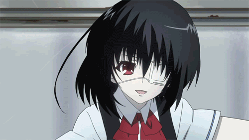
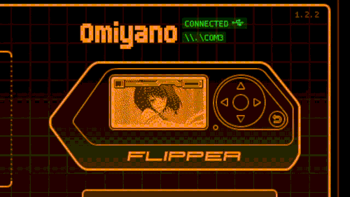
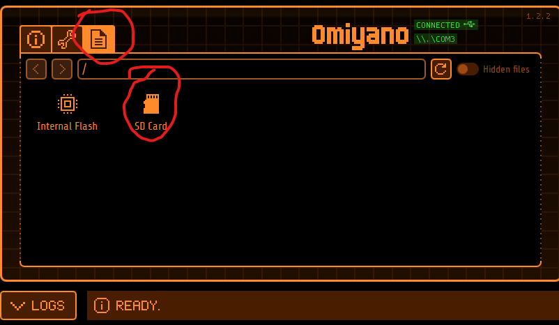

# flipperzero-misaki-mei
FlipperZero animations and passport photo replacement with Misaki Mei

Original GIF               |  Flipper screen implementation
:-------------------------:|:-------------------------:
          |  

# Animations
## Usage 
1. Download the compiled animation from latest [release](https://github.com/meth1337/flipperzero-misaki-mei/releases/latest) (the thing you're interested in is `misaki.zip`)
2. Download the [qFlipper](https://flipperzero.one/update) if you don't have it
3. Unzip `misaki.zip` into separate folder
4. Run qFLipper & plug your flipper to your PC
5. Go to file manager  
6. Go to `/SD Card/dolphin` directory
7. Drag & drop the folder from step 3
8. Reboot your flipper and you're done!

https://user-images.githubusercontent.com/77743895/210234805-97f16c9d-a32d-4091-bab0-8f27acc61362.mp4

(sorry i have tremor)

